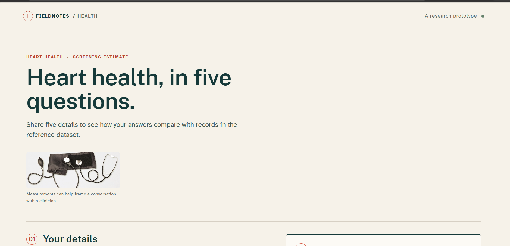
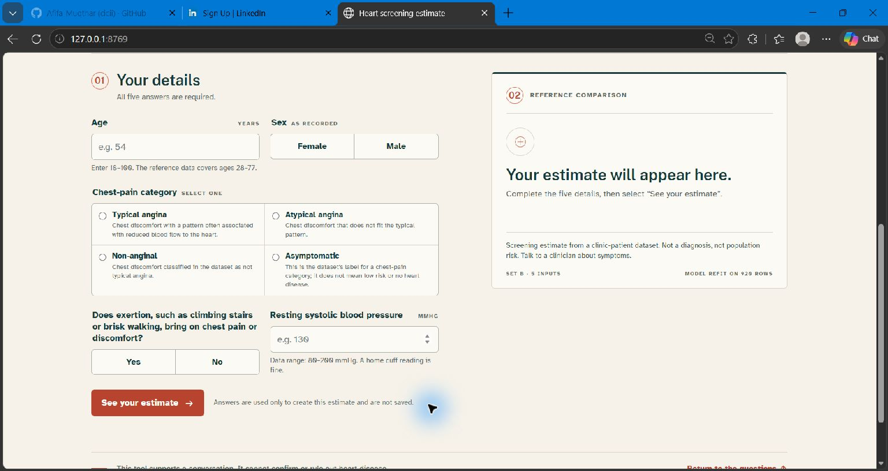
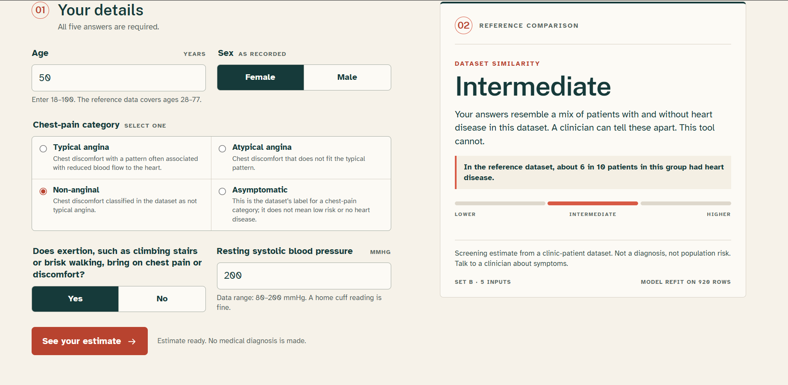
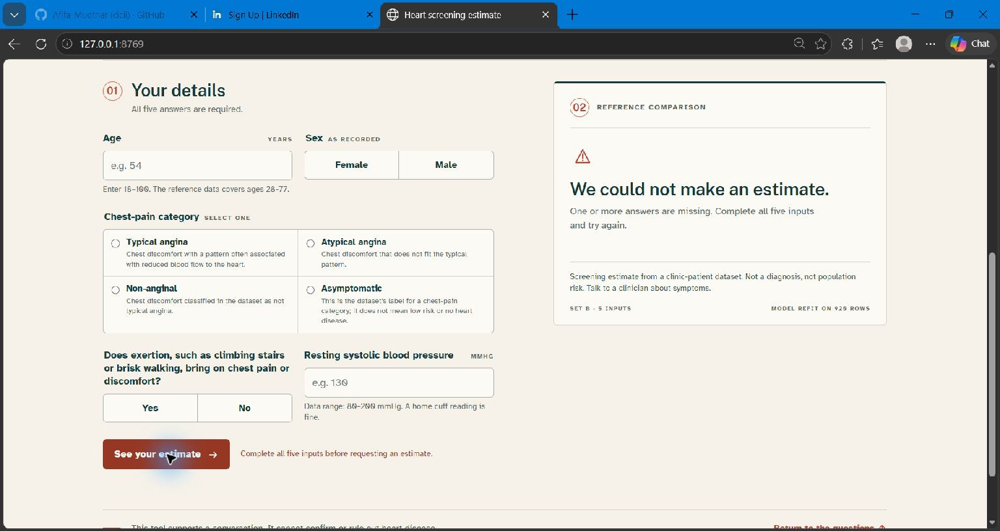

# Heart health screening estimate

A five-input Flask prototype that compares answers with records in the UCI Heart Disease clinic dataset; it is a screening estimate, not a diagnosis.

## Interface Preview

### Home


### Form


### Result


### Validation error


### Mobile

Mobile preview is pending a screenshot at about 390 pixels wide.

## How It Works

The browser requires age, sex, chest-pain category, exertion-related discomfort, and resting systolic blood pressure. It sends those five values as JSON to `POST /api/predict`. Flask validates the values, builds a one-row pandas DataFrame in the saved feature order, and calls the serialized scikit-learn pipeline. The route responds with a band, its name, and explanatory copy; it does not return the raw score. Inputs are not logged or stored by the app.

## Model and Evaluation

The approved Set B Random Forest uses the target rule `num > 0` and the feature order age, sex, cp, exang, trestbps. The model was refit on all 920 rows. Headline grouped cross-validation results are recall **0.86**, precision **0.73**, and ROC-AUC **0.81 ± 0.06**. Leave-one-site-out ROC-AUC ranged from **0.66 to 0.84**. The holdout was previously viewed during candidate selection and is not presented as independent final validation.

## Tech Stack

Python 3.12, Flask, pandas, joblib, scikit-learn, HTML, CSS, and vanilla JavaScript. The Vercel Python runtime serves the root `app.py` WSGI application; files under `public/` are static assets.

## Run Locally

In Windows PowerShell, from the repository root:

```powershell
py -3.12 -m venv .venv
.\.venv\Scripts\python.exe -m pip install -r requirements.txt
.\.venv\Scripts\python.exe app.py
```

Open [http://127.0.0.1:8000](http://127.0.0.1:8000). The server reads `PORT` when set and binds to `127.0.0.1` for local runs. Vercel exposes the same Flask `app` as a Python function.

### Deploy from GitHub with Vercel

1. Push this repository to GitHub, excluding local datasets, virtual environments, and candidate models as configured by `.gitignore`.
2. In Vercel, choose **Add New → Project**, connect GitHub if prompted, and **Import** the repository.
3. Keep the project root at the repository root. Let Vercel detect the Python app; do not set a static output directory or build command.
4. Confirm the Python runtime is 3.12 and deploy. The root `app.py` exports `app`; `public/` contains the static files.
5. After deployment, open the generated URL and check `/health`, the page, and a prediction submission. Each future push to the connected production branch triggers a deployment.

## Limitations

This is a screening estimate from clinic patients, not a diagnosis or population-risk estimate. The dataset has four source-site populations and does not represent the general population. Cross-validation folds and site-held-out evaluations are descriptive, not prospective clinical validation. The bands were derived from out-of-fold scores of models trained on subsets of the data; the deployed pipeline was refit on all 920 rows, so band membership and group rates may differ. Performance varies by held-out site. No clinical usefulness, calibration, subgroup fairness, or prospective safety has been established.

## Data Source and Credits

Dataset: Janosi, A., Steinbrunn, W., Pfisterer, M., and Detrano, R. (1989), [UCI Heart Disease](https://doi.org/10.24432/C52P4X), CC BY 4.0. The repository's local CSV extraction history was not verified. The photo and self-hosted font sources and licenses are recorded in [assets/CREDITS.md](assets/CREDITS.md).
